# STANDING STRAIGHT

STANDING STRAIGHT is a responsive website built for the sole purpose of completing the first Milestone Project for the Code Institute's Full Stack Developer course. It was built using the knowledge gained from the HTML, CSS and User Centric Design modules.

The live website can be viewed here [STANDING STRAIGHT](https://bogdanmaria.github.io/standingstraight/).

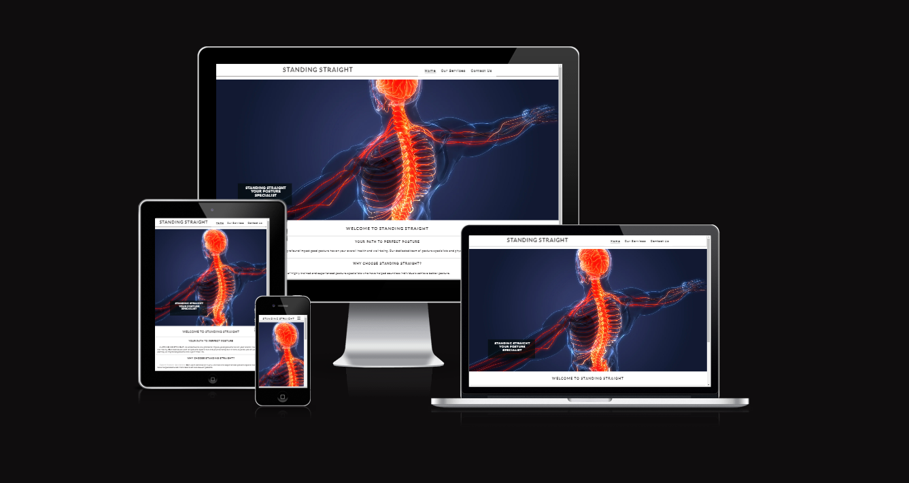

## User Experience (UX)

 ### User Stories:
- #### As a first-time user:
    - I want to easily understand the main purpose of the site and learn more about the topic.
	- I want to easily navigate the website.
	- I want to be able to contact them to book a session or ask further questions.
	
- #### As a returning visitor:
	- I want to be able to navigate to further social media sites to see more work and reviews of the company.
	- I want to easily find a way to contact the business- if I haven’t already.

- #### As a frequent visitor:
    - I want to be able to use the website across multiple devices without too much difference in the site content.

## Design:
### Typography
The font family Lato was chosen for the website navigation menu due to the simplicity of it and font family Roboto has been chosen for the body as it was a nice simple and minimalistic font.
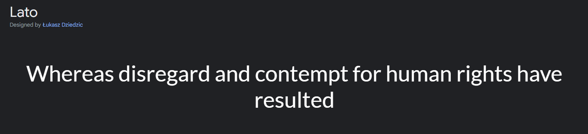
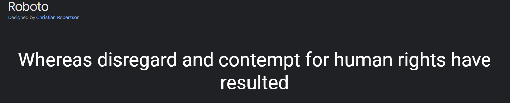

### Imagery
A image of a translucent human body with the spine and nervous system highlighted has been chosen as the hero image due to the theme of the website: posture corection physiotherapy.

### Colour Scheme:
The colour scheme used is simple and it uses  #322E2E as main colour fot text, #746F6E for the shadow, #b11d03 for the sumbit button on the conact form.

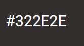 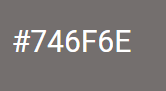 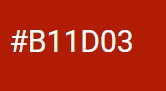

## Wireframes:
### HOME
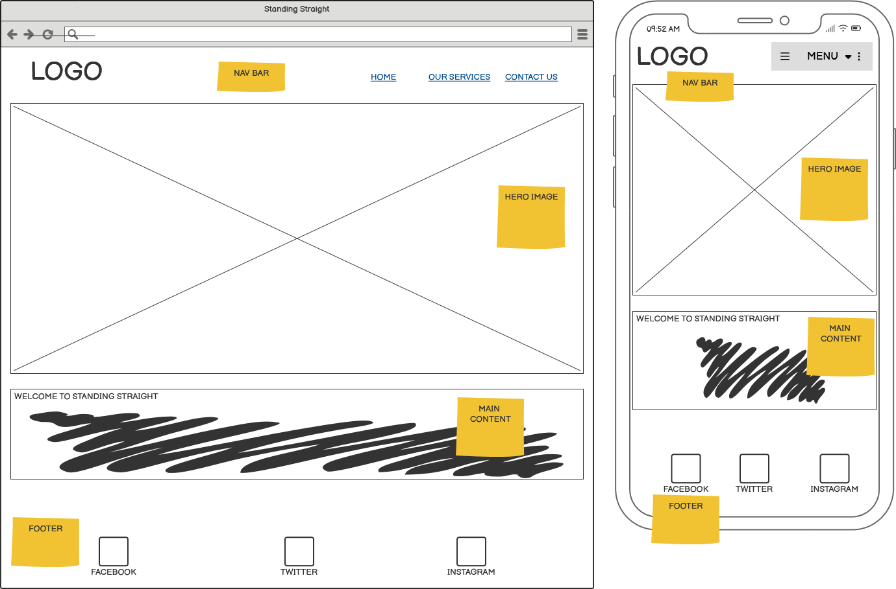
### OUR SERVICES

### CONTACT
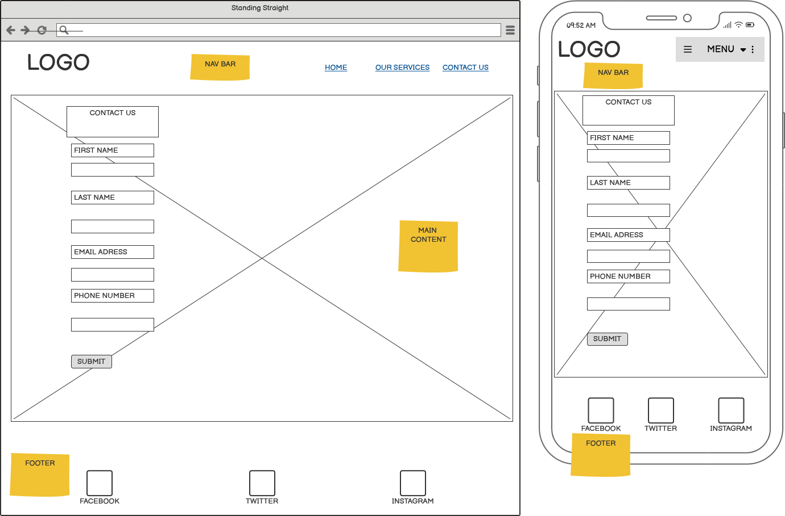

## Features:

### Existing Features

- Navigation Menu
  - The navigation menu appears on all three pages and is a fully responsive bar that can direct you to the About, Gallery and Contact pages. The style remains the same on all pages for easy navigation.
  - The navigation menu section allows the user to navigate between pages without using the “back” button.
  - This menu is responsive on different screen sizes and allows the menu to shrink on mobile view to allow more screen space for the user.
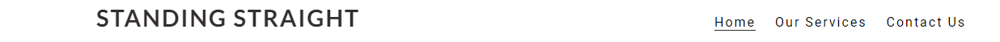

- Foooter
  - The footer section allows the user to visit the business’ social media sites through use of links.
  - These links will open in a new window to allow the user to continue navigating through the site without using the back button.
  - The footer remains the same on all pages to keep the social media links easy to find.
  - The footer hopes to connect the business with more users and clients via social media sites.

- Our services
  - This page is listing the services that can be offered.
  - Gives the user an idea about the quipment used.
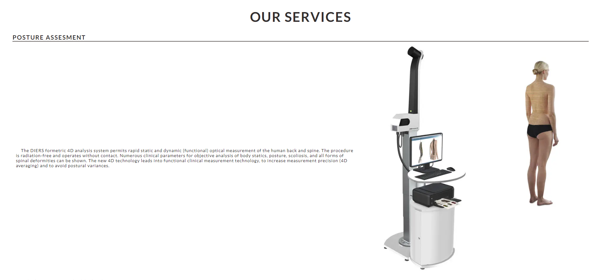

- Contact form details section
  - This form allows the user to enter details for the business to contact them.
  - Use of placeholder text and required fields provides the user easy navigation through the form so that any questions about entering details is eliminated.
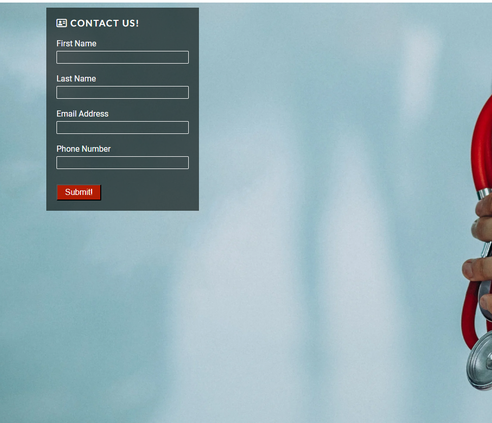

## Technologies

- HTML to accomplish the structure of the website.
- CSS to style the website.
- [Codeanywhere](https://app.codeanywhere.com/) IDE to develop the website.
- [GitHub](https://GitHub.com/) to host the source code and GitHub Pages to deploy and host the live site.
- Git to provide version control (to commit and push code to the repository).
- [FontAwesome](https://fontawesome.com/) to provide the icons used.
- [Google Fonts](https://fonts.google.com/) for typography.
- [Google Chrome Dev Tools](https://developers.google.com/web/tools/chrome-devtools) for debugging, inspecting pages' elements and testing layout.
- [Online-convert](https://www.online-convert.com/) to optimise images to reduce storage and enhance the website performance.
- [Favicon.cc](https://www.favicon.cc/) to create the website favicon.
- [Color](https://www.htmlcsscolor.com/) to source colour palette.
- [Balsamiq](https://balsamiq.com/wireframes/) to design wireframes.
- [Amiresponsive](https://ui.dev/amiresponsive) to create the Mockup image in this README.
- Google Chrome's [Lighthouse](https://developers.google.com/web/tools/lighthouse) to assess accessibility.
- [W3C HTML Markup Validator](https://validator.w3.org/) to validate HTML code.
- [W3C Jigsaw CSS Validator](https://jigsaw.w3.org/css-validator/) to validate CSS code.
- Code Institute's Gitpod Template to generate the workspace for the project.
