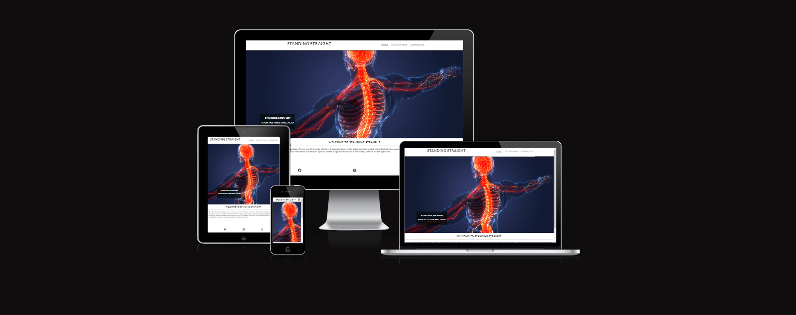

# STANDING STRAIGHT

STANDING STRAIGHT is a responsive website built for the sole purpose of completing the first Milestone Project for the Code Institute's Full Stack Developer course. It was built using the knowledge gained from the HTML, CSS and User Centric Design modules. A full list of technologies used can be found in the technologies section of this document.

The live website can be viewed here [STANDING STRAIGHT](https://bogdanmaria.github.io/standingstraight/).

