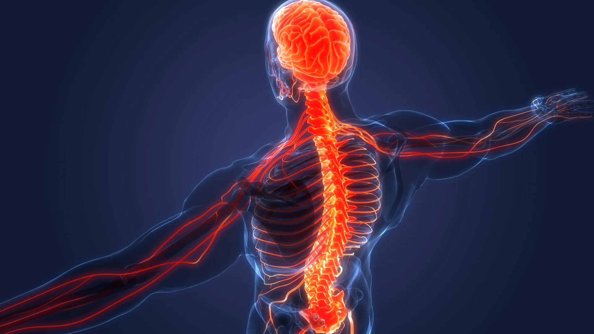

# STANDING STRAIGHT

STANDING STRAIGHT is a responsive website built for the sole purpose of completing the first Milestone Project for the Code Institute's Full Stack Developer course. It was built using the knowledge gained from the HTML, CSS and User Centric Design modules.

The live website can be viewed here [STANDING STRAIGHT](https://bogdanmaria.github.io/standingstraight/).

## User Experience (UX)

 ### User Stories:
- #### As a first-time user:
    - I want to easily understand the main purpose of the site and learn more about the topic.
	- I want to easily navigate the website.
	- I want to be able to contact them to book a session or ask further questions.
	
- #### As a returning visitor:
	- I want to be able to navigate to further social media sites to see more work and reviews of the company.
	- I want to easily find a way to contact the business- if I haven’t already.

- #### As a frequent visitor:
    - I want to be able to use the website across multiple devices without too much difference in the site content.

## Design:
### Typography
The font family Lato was chosen for the website navigation menu due to the simplicity of it and font family Roboto has been chosen for the body as it was a nice simple and minimalistic font.

### Imagery
A image of a translucent human body with the spine and nervous system highlighted has been chosen as the hero image due to the theme of the website: posture corection physiotherapy.

### Colour Scheme:
The colour scheme used is simple and it uses  #322E2E as main colour fot text, #746F6E for the shadow, #b11d03 for the sumbit button on the conact form.

  

## Wireframes:
### HOME

### OUR SERVICES

### CONTACT

## Features:

### Existing Features

- Navigation Menu
  - The navigation menu appears on all three pages and is a fully responsive bar that can direct you to the About, Gallery and Contact pages. The style remains the same on all pages for easy navigation.
  - The navigation menu section allows the user to navigate between pages without using the “back” button.
  - This menu is responsive on different screen sizes and allows the menu to shrink on mobile view to allow more screen space for the user.
